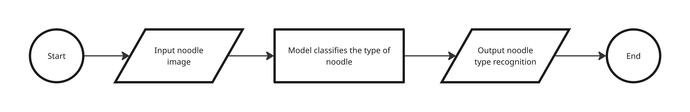
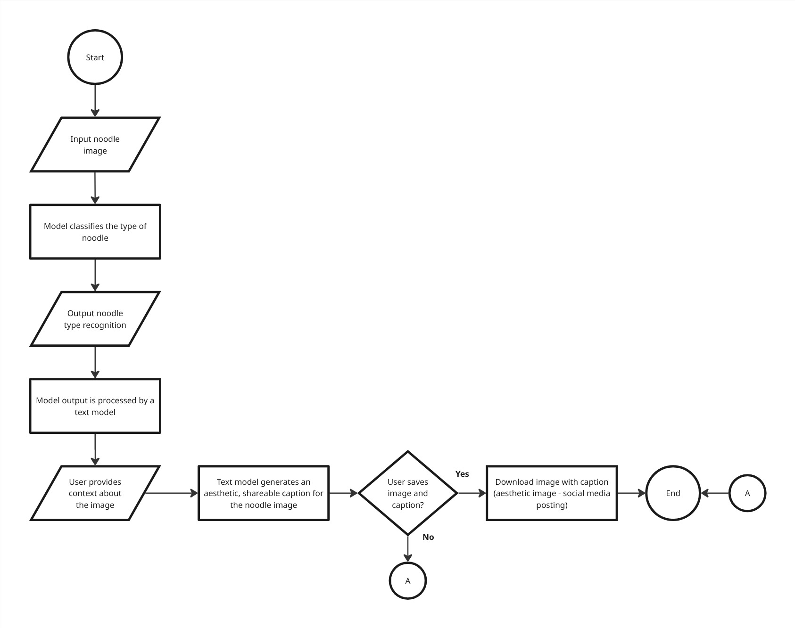

# Noodle Classification System (NCS)

The Noodle Classification System is a web application that automatically classifies images of noodles into three categories: **spaghetti**, **ramen**, and **udon**.  

The goal is to apply **SLC** (Simple, Lovable, Complete) approach to this web app. 

## Acknowledgements

- Model and dataset sourced from [YunZhuHuang327/Noodle-Type-Recognition](https://github.com/YunZhuHuang327/Noodle-Type-Recognition).

## Process Flow

Below is the basic process flow of the NCS, following the SLC approach:

## Future Updates

Planned features include:
- Integration of a model capable of generating captions for noodle images, providing context and reasoning for the classification.

---